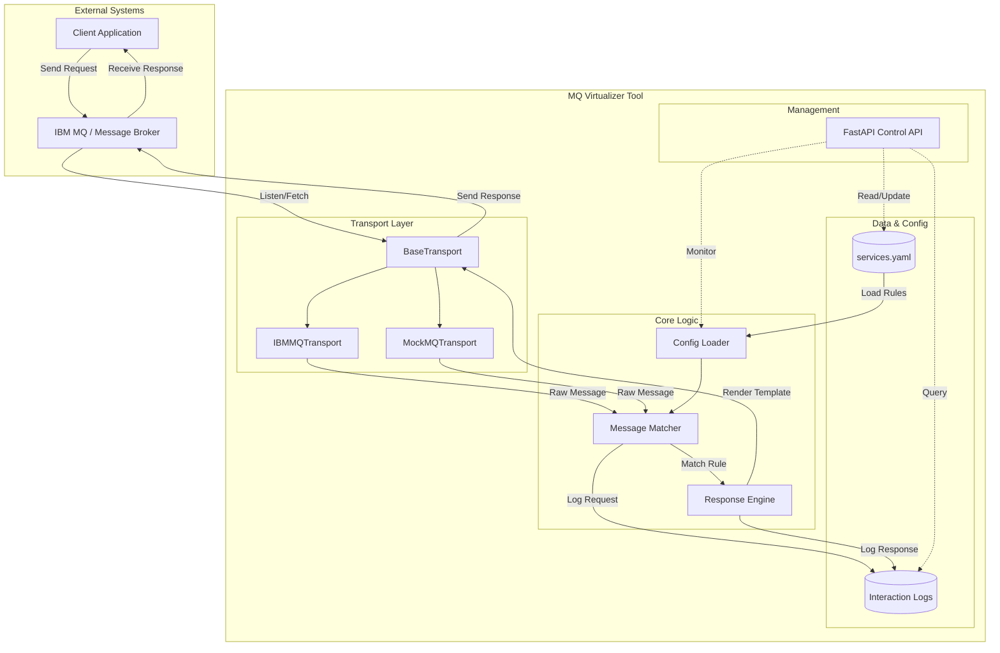

# High-Level Design (HLD) - MQ Virtualizer

The following diagram illustrates the architecture of the MQ Service Virtualization platform and how messages flow through the system.

## Component Descriptions

### 1. Transport Layer
Abstracts the underlying messaging protocol. It handles the connection lifecycle and provides a unified interface for listening to and sending messages.

### 2. Message Matcher
The "Brain" of the system. It evaluates incoming messages against a set of rules using **Regex** or **JSONPath**.

### 3. Response Engine
Responsible for generating the response payload. It uses **Jinja2** templates to support dynamic data injection from the request into the response.

### 4. Config Loader
Parses the `services.yaml` file and hydrates the internal data models. It allows for declarative service definitions.

### 5. Control API
A RESTful interface built with **FastAPI** that allows external tools or users to:
- Enable/Disable virtual services at runtime.
- View live interaction logs.
- Update configurations (Planned).

### 6. Configuration (YAML)
A human-readable file where all virtual services, their input/output queues, and matching rules are defined.
